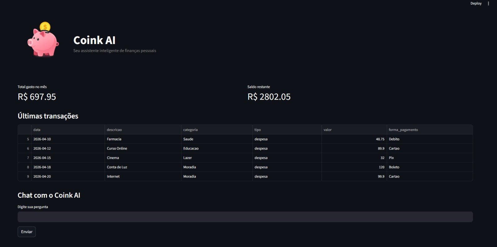

<p align="center">
  
</p>

<p align="center">
Seu assistente inteligente de finanças pessoais com IA Generativa
</p>

<p align="center">
Controle seus gastos, acompanhe seu orçamento e receba orientações financeiras de forma simples, prática e inteligente.
</p>

---

# 📌 Sobre o Projeto

O **Coink AI** é um agente financeiro inteligente criado para ajudar pessoas a organizarem suas finanças pessoais no dia a dia.

Muitas pessoas têm dificuldade para entender para onde o dinheiro está indo, controlar despesas mensais e criar hábitos financeiros saudáveis. Pensando nisso, o Coink AI utiliza **Inteligência Artificial Generativa** para transformar dados financeiros em respostas úteis, claras e contextualizadas.

---

# 🚀 Principais Funcionalidades

- 📊 Visualização do total gasto no mês
- 💰 Cálculo automático do saldo restante
- 📄 Histórico de transações financeiras
- 🤖 Chat inteligente com IA local via Ollama
- 📌 Respostas baseadas nos dados reais do usuário
- 🔒 Segurança contra respostas inventadas
- ⚡ Interface rápida e intuitiva em Streamlit

---

# 🖥️ Interface da Aplicação

<p align="center">
  
</p>

---

# 🧠 Tecnologias Utilizadas

| Categoria | Tecnologias |
|----------|-------------|
| Interface | Streamlit |
| Linguagem | Python |
| IA Local | Ollama |
| Manipulação de Dados | Pandas |
| Estrutura de Dados | JSON / CSV |
| Versionamento | Git + GitHub |

---

# 📂 Estrutura do Projeto

```bash
finance-assistant-ai/
│
├── assets/
│   ├── banner.png
│   ├── coink-logo.png
│   └── interface-coink.png
│
├── data/
│   ├── categorias.json
│   ├── orcamento_mensal.json
│   ├── resumo_usuario.json
│   └── transacoes.csv
│
├── docs/
│   ├── 01-documentacao-agente.md
│   ├── 02-base-conhecimento.md
│   ├── 03-prompts.md
│   ├── 04-metricas.md
│   └── 05-pitch.md
│
├── src/
│   ├── agente.py
│   ├── app.py
│   ├── config.py
│   ├── requirements.txt
│   └── utils.py
│
└── README.md
```

---

# ⚙️ Como Executar o Projeto

## 1️⃣ Clone o repositório

```bash
git clone https://github.com/bryannduart/finance-assistant-ai.git
cd finance-assistant-ai
```

---

## 2️⃣ Instale as dependências

```bash
py -m pip install -r src/requirements.txt
```

ou

```bash
python -m pip install -r src/requirements.txt
```

---

## 3️⃣ Instale o Ollama

Baixe e instale pelo site oficial:

👉 https://ollama.com/download

---

## 4️⃣ Baixe o modelo local

```bash
ollama pull llama3
```

---

## 5️⃣ Execute a aplicação

```bash
py -m streamlit run src/app.py
```

ou

```bash
python -m streamlit run src/app.py
```

---

# 💬 Exemplos de Perguntas no Chat

```text
Quanto eu já gastei esse mês?
Qual é meu saldo restante?
Quais foram minhas últimas transações?
Em que categoria eu mais gastei?
Onde posso economizar?
```

---

# 🔒 Segurança e Confiabilidade

O Coink AI foi desenvolvido para responder com base nos dados cadastrados, mantendo foco em finanças pessoais e evitando respostas inventadas.

## Estratégias adotadas

- Respostas baseadas em dados reais armazenados em arquivos JSON e CSV
- Uso de contexto financeiro do usuário para gerar respostas mais assertivas
- Limitação clara de escopo para evitar respostas fora da proposta do agente
- Recusa de pedidos sensíveis ou indevidos
- Transparência quando faltar contexto ou informação suficiente
- Integração com modelo local via Ollama, reduzindo dependência de serviços externos pagos

---

# 📈 Resultados Obtidos

Durante os testes realizados, o Coink AI apresentou resultados satisfatórios para a proposta inicial do projeto.

## Principais pontos observados

- Respostas corretas sobre total gasto no mês
- Cálculo funcional do saldo restante
- Consulta de transações exibida corretamente na interface
- Integração bem-sucedida entre Streamlit, Python, dados mockados e Ollama
- Respostas contextualizadas com base nas informações disponíveis
- Interface simples, funcional e adequada para demonstração do agente

## O que pode evoluir futuramente

- Melhor formatação monetária em padrão brasileiro
- Registro de novas despesas diretamente pelo chat
- Dashboard com gráficos e análises visuais
- Histórico de conversas
- Respostas ainda mais naturais e personalizadas
- Melhor tratamento visual para erros e carregamento

---

# 🌍 Impacto do Projeto

O Coink AI demonstra como a Inteligência Artificial pode ser aplicada a um problema real do cotidiano: o controle financeiro pessoal.

Com uma solução simples e acessível, o projeto pode contribuir para que mais pessoas:

- entendam melhor seus gastos mensais
- criem hábitos financeiros mais saudáveis
- reduzam desperdícios
- tomem decisões mais conscientes sobre seu dinheiro
- tenham maior organização financeira no dia a dia

Além disso, o projeto mostra o potencial da IA Generativa quando combinada com contexto, dados estruturados e foco em utilidade prática.

---

# 👨‍💻 Autor

**Bryan Duarte**  
Estudante de Engenharia de Software  
Desenvolvedor do projeto **Coink AI**

GitHub: [bryannduart](https://github.com/bryannduart)
