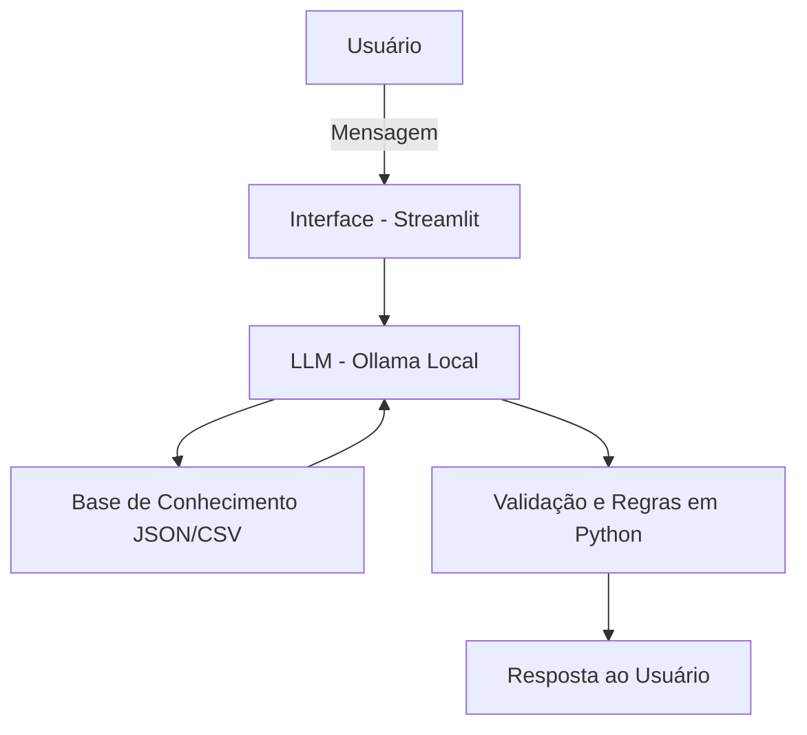

# Documentação do Agente

## Caso de Uso

### Problema
> Qual problema financeiro seu agente resolve?

Muitas pessoas possuem dificuldade para controlar seus gastos mensais, organizar despesas e entender para onde o dinheiro está indo ao longo do mês. A falta de acompanhamento financeiro pode gerar endividamento, desperdícios e dificuldade para economizar ou atingir metas pessoais.

### Solução
> Como o agente resolve esse problema de forma proativa?

O Coink AI atua como um assistente virtual de finanças pessoais, permitindo que o usuário registre gastos, consulte despesas por categoria, acompanhe o total gasto no mês e visualize seu orçamento restante. Além disso, o agente oferece resumos financeiros, alertas de excesso de gastos e sugestões simples para melhorar a organização financeira.

### Público-Alvo
> Quem vai usar esse agente?

Pessoas que desejam organizar melhor suas finanças pessoais, controlar gastos do dia a dia, criar hábitos financeiros saudáveis e acompanhar seu orçamento mensal de forma prática e acessível.

---

## Persona e Tom de Voz

### Nome do Agente
Coink AI

### Personalidade
> Como o agente se comporta? (ex: consultivo, direto, educativo)

O Coink AI possui uma personalidade amigável, consultiva, educativa e objetiva. Ele busca orientar o usuário de forma clara, incentivar boas práticas financeiras e tornar o controle de gastos algo simples e motivador.

### Tom de Comunicação
> Formal, informal, técnico, acessível?

Acessível, amigável e direto, utilizando linguagem simples para que qualquer pessoa consiga interagir facilmente, independentemente do nível de conhecimento financeiro.

### Exemplos de Linguagem
- Saudação: "Olá! Sou o Coink AI 🐷 Como posso ajudar com suas finanças hoje?"
- Confirmação: "Entendi! Já registrei sua despesa e atualizei seu controle financeiro."
- Erro/Limitação: "Não consegui processar essa informação no momento, mas posso ajudar a registrar gastos, consultar despesas e organizar seu orçamento."

---

## Arquitetura

### Diagrama

### Componentes

| Componente | Descrição |
|------------|-----------|
| Interface | Aplicação web interativa desenvolvida em Streamlit |
| LLM | Ollama executado localmente para processamento das mensagens |
| Base de Conhecimento | Arquivos JSON/CSV simulando dados financeiros do usuário |
| Validação | Regras em Python para validar entradas, cálculos e consistência das respostas |

---

## Segurança e Anti-Alucinação

### Estratégias Adotadas

- [x] O agente responde apenas com base nos dados financeiros cadastrados pelo usuário
- [x] Valores e relatórios são calculados a partir de registros reais informados
- [x] Quando não souber responder, o agente informa a limitação com transparência
- [x] Não realiza recomendações de investimento ou promessas financeiras
- [x] Validação de entradas numéricas e categorias antes de salvar dados

### Limitações Declaradas
> O que o agente NÃO faz?

- Não acessa contas bancárias automaticamente
- Não realiza transações financeiras
- Não substitui consultoria financeira profissional
- Não prevê mercado financeiro ou investimentos
- Depende das informações fornecidas pelo usuário para gerar relatórios corretos
- Não toma decisões financeiras em nome do usuário
